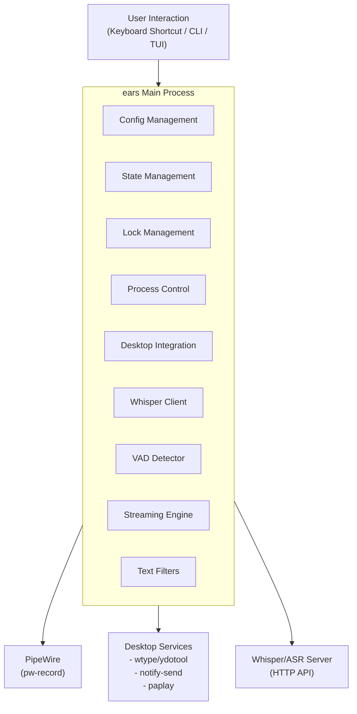
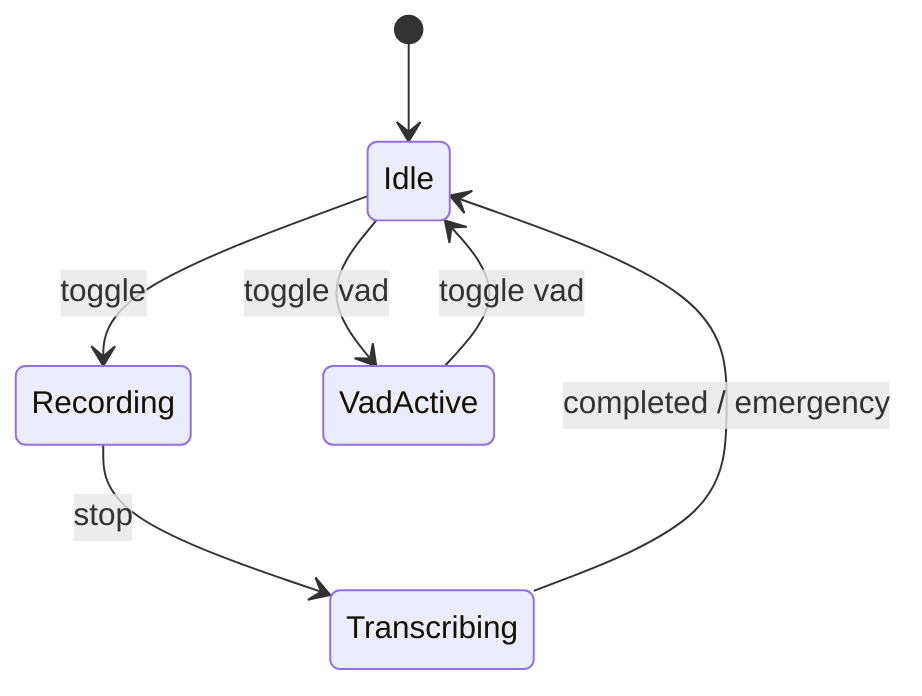

# Architecture Overview

Technical architecture of the ears speech recognition daemon.

## High-Level Architecture



## Core Components

### Configuration (`config.rs`)

Manages app configuration using individual files in `~/.config/ears/`:

| File | Purpose |
|------|---------|
| `server` | Whisper server URL (plain text) |
| `device` | PipeWire device name (plain text) |
| `language` | Language code or empty for auto-detect |
| `text_filters.json` | Text filter settings (JSON) |

Environment variables (`EARS_SERVER`, `EARS_DEVICE`, `EARS_LANGUAGE`) override file config.

### State Machine (`state.rs`)

Four states: `Idle`, `Recording`, `Transcribing`, `VadActive`.



State is persisted to `$XDG_RUNTIME_DIR/ears/state` as plain text. On startup, stale states (e.g., `Recording` with no live process) are automatically reconciled to `Idle`.

### Lock Management (`lock.rs`)

Uses `flock(2)` for single-instance enforcement. Lock file at `$XDG_RUNTIME_DIR/ears/lock`. RAII pattern ensures automatic release.

### Process Control (`process.rs`)

Manages `pw-record` subprocess: PID tracking, graceful shutdown (SIGTERM → wait → SIGKILL), stale PID detection.

### Whisper Client (`whisper.rs`)

HTTP client for OpenAI-compatible `/v1/audio/transcriptions` endpoint:
- Multipart form upload (file + response_format + optional language)
- Exponential backoff retry (100ms initial, 5s max, 30s total)
- Silence artifact filtering ("Thank you.", "Thanks for watching.", etc.)
- rustls TLS (no OpenSSL dependency)

### Desktop Integration (`desktop.rs`)

- **Text Input**: `wtype` on Hyprland/Wayland (direct typing), clipboard paste via `ydotool` + `wl-copy` elsewhere
- **Notifications**: `notify-send` with urgency levels
- **Audio Feedback**: Embedded WAV sounds with custom override from `~/.local/share/ears-sounds/`
- **Keyboard Layout**: Detects layout via `hyprctl` (Hyprland) or `dconf` (GNOME) for automatic language selection

### Text Filters (`text_filters.rs`)

Configurable transformations: `lowercase` and `remove_punctuation`. Stored in `~/.config/ears/text_filters.json`.

### VAD (`vad.rs`)

Energy-based Voice Activity Detection. Processes audio frames, tracks speech/silence durations, and emits speech segments.

### Streaming Engine (`streaming_engine.rs`)

Coordinates VAD detection, whisper transcription, LocalAgreement policy, and progressive typing for real-time streaming mode.

### LocalAgreement (`streaming.rs`)

Ensures only stable text prefixes are typed by requiring N consecutive transcription iterations to agree on a common prefix before committing it.

## Data Flow

### Push-to-Talk Flow

```
1. User presses shortcut → ears toggle
2. Acquire lock → check state
3. If Idle: spawn pw-record → transition to Recording → beep
4. If Recording: stop pw-record → validate WAV → POST to whisper
   → filter artifacts → apply text filters → type text → beep → Idle
```

### VAD Flow

```
1. ears vad → check for existing VAD process
2. If running: send SIGTERM → stop
3. If not running: start pipeline → write PID → transition to VadActive
4. Pipeline: continuous capture → VAD → segment → whisper → type
5. On SIGTERM/SIGINT: shutdown pipeline → remove PID → Idle
```

## Design Decisions

- **File-based state**: Simple, debuggable (`cat` the state file), auto-cleaned by `$XDG_RUNTIME_DIR`
- **Separate invocations**: Each `ears toggle` is a new process; no daemon needed
- **PipeWire over ALSA**: Modern, better device isolation, native on recent distros
- **Async I/O**: Tokio runtime for non-blocking HTTP (whisper client)
- **wtype over ydotool on Hyprland**: Direct Wayland text input, no daemon needed, better Unicode

## External Dependencies

See `CLAUDE.md` for the full dependency table with packages and purposes.

## Testing

```bash
cargo test                     # All tests
cargo test config              # Specific module
cargo clippy -- -D warnings    # Lint
cargo fmt -- --check           # Format check
```

Tests use `tempfile` for directories, `wiremock` for HTTP mocking, `serial_test` for env var tests.
